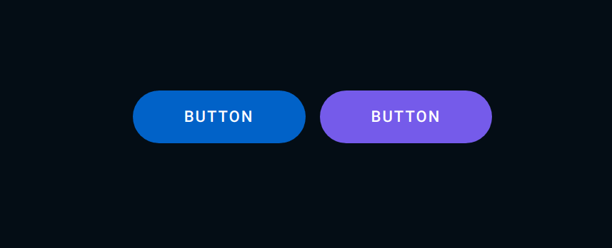

# Button-Styled

O poder do css é incrível

<h1 align="center">
  
</h1>

### Resultado

Entender a utilização do nth-child nos dá uma possibilidade de selecionar um elemento específico, muito útil.

Criar um elemento em uma variável, colocá-lo dentro de um outro elemento, e depois retirá-lo abre muitas possibilidades de efeitos incríveis.
